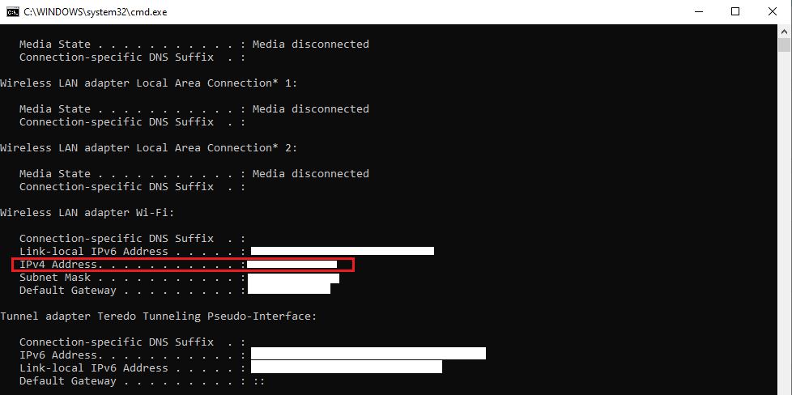
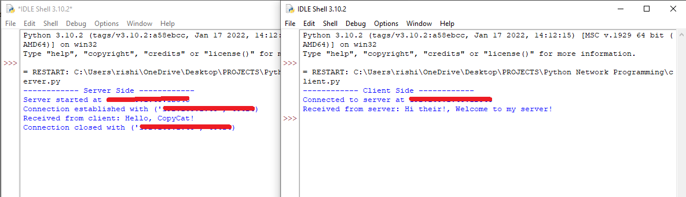

# Network-Programming (Simple TCP Server)

This project demonstrates a simple TCP server in Python that listens for incoming connections, receives a message from the client, and sends a response back to the client.

## Getting Started

These instructions will guide you through running the TCP server on your machine & client.

### Prerequisites

You need to have Python installed on your machine. You can download and install Python from [here](https://www.python.org/downloads/).

### Installation

1. Clone the repository to your local machine:

    ```bash
    git clone https://github.com/RishiAravind2004/Network-Programming.git
    ```

2. Navigate to the project directory:

    ```bash
    cd Network-Programming
    ```

    **Or**

    Simply download both server ([server.py](https://github.com/RishiAravind2004/Network-Programming/raw/main/server.py)) and client ([client.py](https://github.com/RishiAravind2004/Network-Programming/raw/main/client.py)) files.

### Configurations & Running the Code

#### Server Side

By default, the server is configured to listen on the IP address `192.168.1.43` and port `12345`. You can change these values in the `server.py` file by modifying the following lines:

```python
if __name__ == "__main__":
    host = '192.168.1.0'  # Change this to your desired IP address
    port = 12345           # Change this to your desired port
    start_server(host, port)
```
change the desired Ip address server's with IPV4

**Windows**

Use the `ipconfig` command in Command Prompt to find your computer's IPv4 address.


**Linux**

Use the `ifconfig` command in the terminal.

After editing the configuration run `server.py` file, Server will start and listen for incoming connections on the specified IP address and port.

> Client Side

To run the client, you can use the provided client.py file. Ensure that you update the client.py file with the correct IP address and port that the server is listening on.

After editing the configuration in client.py with the correct IP address and port that the server is listening on

### Make sure server file is running before running client file.

# Working

How the server and client sides work in a simple TCP communication setup using Python.

# Network-Programming (Simple TCP Server)

## Server Side:

### Socket Creation:

The server creates a socket using `socket.socket(socket.AF_INET, socket.SOCK_STREAM)`. This specifies IPv4 (`socket.AF_INET`) and TCP (`socket.SOCK_STREAM`) for the communication protocol.

### Binding and Listening:

The server binds the socket to a specific IP address and port using `server_socket.bind((host, port))`.
It then listens for incoming connections with `server_socket.listen(5)`, where 5 specifies the maximum number of queued connections.

### Accepting Connections:

When a client tries to connect, `server_socket.accept()` is called, which blocks until a connection is established.
It returns a new socket (`client_socket`) and the address (`client_address`) of the client.

### Handling Client Communication:

With the `client_socket`, the server can now send and receive data.
It receives data from the client using `client_socket.recv(buffer_size)` and sends responses using `client_socket.sendall(data)`.

### Closing Connections:

After communication is complete, the server closes the `client_socket` to release resources with `client_socket.close()`.

## Client Side:

### Socket Creation:

Similar to the server, the client creates a socket using `socket.socket(socket.AF_INET, socket.SOCK_STREAM)`.

### Connecting to Server:

The client connects to the server using `client_socket.connect((host, port))`, where `host` is the server's IP address and `port` is the server's port number.

### Sending and Receiving Data:

After establishing the connection, the client can send data to the server using `client_socket.sendall(data)` and receive responses using `client_socket.recv(buffer_size)`.

### Closing Connection:

Once the client finishes sending and receiving data, it closes the socket with `client_socket.close()`.

## Example Scenario:

### Server Setup:

The server is configured to listen on IP address `192.168.1.43` and port `12345`.

### Client Setup:

The client connects to `192.168.1.43:12345` and sends a message "Hello from the client!" to the server.

### Server Response:

The server receives the message, processes it, and sends back a response "Hello from the server!" to the client.

### Client Output:

The client displays the received response "Hello from the server!".

## Summary:

- **Server**: Listens for incoming connections, accepts client connections, processes client requests, and sends responses.
  
- **Client**: Establishes a connection to the server, sends requests, receives responses, and closes the connection.

